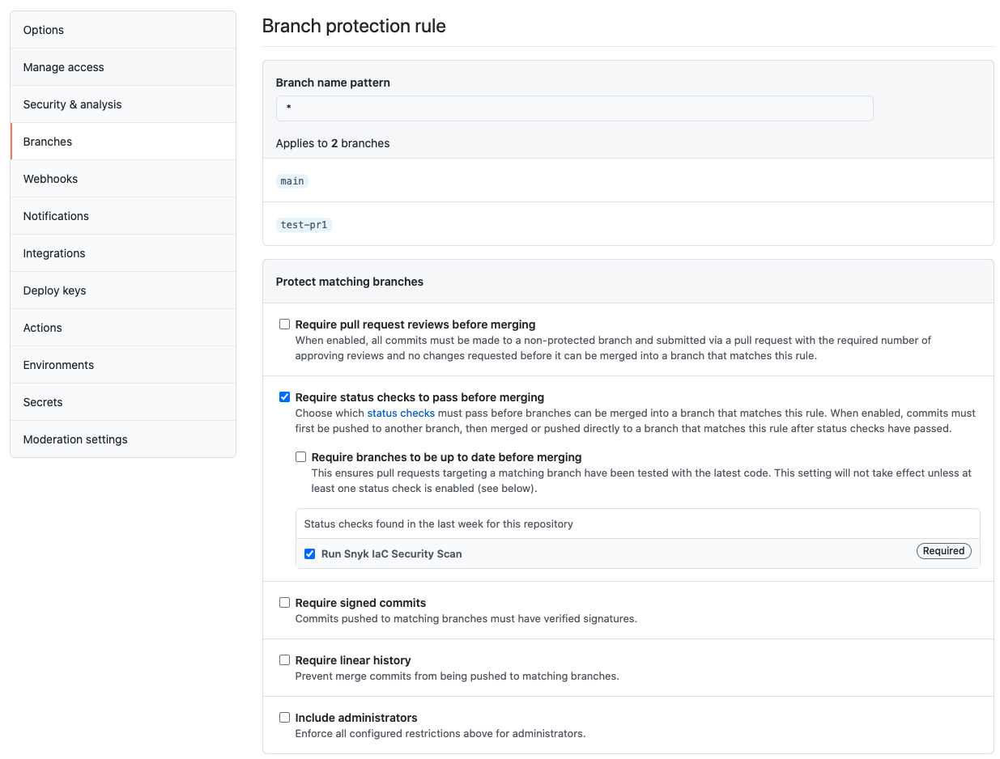

# Snyk Infrastructure As Code - GitHub PR Example

This example shows how you can integrate Snyk IaC CLI into a PR based workflow.

Upon raising a Pull Request, the following steps will happen:

- Scan all of the configuration files in this repository using the Snyk IaC CLI
- Upload the results to GitHub Security
- Add a comment to the Pull Request with the output of the security scan
- Block the PR Merge if there are open high-severity issues
- Allow the PR to be merged if there are no open high-severity issues

## Setup

### Tokens

Add a secret to your repository called `SNYK_TOKEN` with the value of your Snyk API Token.
You can find this at https://app.snyk.io in the settings for your user. Or you can use a service token.

### Commit Statuses

If you want to prevent a PR from being merged, if there are failing checks you can use a combination of Branch protection rules and commit status checks.

Go to the settings for you're repository and create a new branch protection rule as follows

- Pattern of `*` which will cause it to apply to any branch
- Tick `Require status checks to pass before merging`
- Select `Run Snyk IaC Security Scan` as a status check
- Save and apply

## How to use

1. Copy the `.github/workflows/snyk_pr.yaml` file to your GitHub repository
1. Create a branch and make a change
1. Push changes and see the output appear on the PR.
